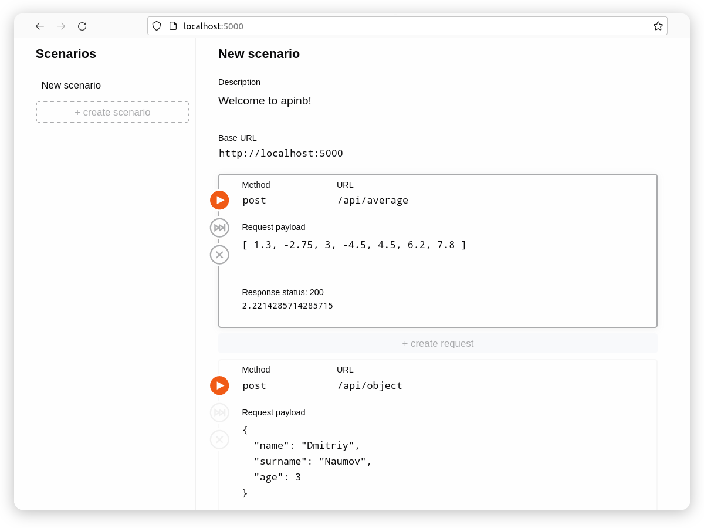

# apinb

Ever thought about interactive-notebook-like in-browser Web API client?

- Interactive-notebook-like
- Runs in browser
- Allows you communicate with Web API

Yes, this thing already exists in this repository!



This repository includes:

- Apinb - a Vue 3 application that is Web API client
- ServerApp - an example WebAPI server application

## Prerequisites

- node & npm
- dotnet (for ServerApp) 

## Usage

1. Clone this repository
2. To run dev server: 
```
cd Apinb
npm run dev
```
3. To run example server application:
```
cd Apinb
npm run build && \
rm -rf ../ServerApp/wwwroot/* && \
    cp -r ./dist/* ../ServerApp/wwwroot/
    cd ../ServerApp
dotnet run
``` 

## Copyright

- **apinb repository** - Copyright &copy; 2022 - 2023 Dmitriy Naumov naumov1024@gmail.com
- **Vue** - Copyright preserved to [respective owners](https://vuejs.org/)
- **.NET** - Copyright preserved to [respective owners](https://dotnet.microsoft.com/)
